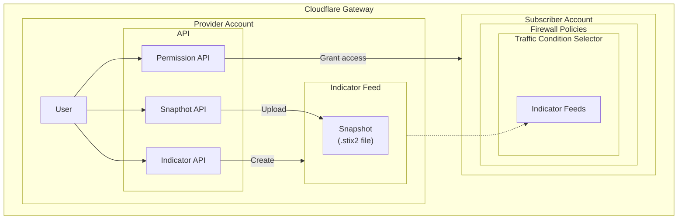

```mermaid
graph TB

subgraph CF [Cloudflare Gateway]

    subgraph Provider [Provider Account]
        subgraph API
            IndicatorAPI[Indicator API]
            SnapthotAPI[Snapthot API]
            PermissionAPI[Permission API]
        end
        subgraph Indicator[Indicator Feed]
            Snapshot["Snapshot<br>(.stix2 file)"]
        end
        User
    end

    subgraph Subscriber [Subscriber Account]
        subgraph FW [Firewall Policies]
            subgraph Selector [Traffic Condition Selector]
                IndicatorSelector[Indicator Feeds]
            end
        end
    end
    
end

User --> IndicatorAPI --> |Create|Indicator
User --> SnapthotAPI --> |Upload|Snapshot
User --> PermissionAPI --> |Grant access|Subscriber

Indicator -.-> IndicatorSelector
```
