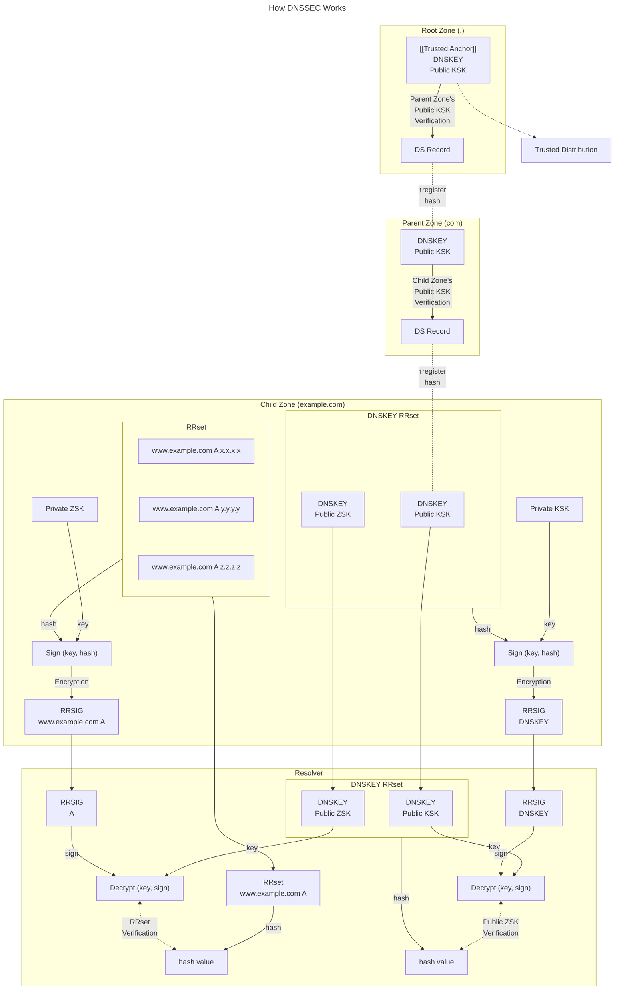

```mermaid
---
title: How DNSSEC Works
---
flowchart TB
subgraph RootZone["Root Zone (.)"]
RootPublicKSK["[[Trusted Anchor]]<br>DNSKEY<br>Public KSK"]
RDS[DS Record]
RootPublicKSK-->|Parent Zone's<br>Public KSK<br>Verification|RDS
end
RDS -.-|"↑register<br>hash"|ParentPublicKSK
RootPublicKSK -.-> a[Trusted Distribution]

subgraph ParentZone["Parent Zone (com)"]
ParentPublicKSK[DNSKEY<br>Public KSK]
DS[DS Record]
ParentPublicKSK-->|Child Zone's<br>Public KSK<br>Verification|DS
end
DS -.-|"↑register<br>hash"|PublicKSK

subgraph ChildZone["Child Zone (example.com)"]
PrivateKSK[Private KSK]
subgraph DNSKEY[DNSKEY RRset]
PublicKSK[DNSKEY<br>Public KSK]
PublicZSK[DNSKEY<br>Public ZSK]
end
PrivateZSK[Private ZSK]

RRsetHash["Sign (key, hash)"]
RRSIG["RRSIG<br>www.example.com A"]

RRset --> |hash|RRsetHash --> |Encryption|RRSIG
PrivateZSK --> |key|RRsetHash

DNSKEYRRsetHash["Sign (key, hash)"]
DNSKEYRRSIG["RRSIG<br>DNSKEY"]

DNSKEY --> |hash|DNSKEYRRsetHash --> |Encryption|DNSKEYRRSIG
PrivateKSK --> |key|DNSKEYRRsetHash

subgraph RRset
direction TB
A1[www.example.com A x.x.x.x]
A2[www.example.com A y.y.y.y]
A3[www.example.com A z.z.z.z]
A1 ~~~ A2 ~~~ A3
end

end

subgraph Resolver
subgraph DNSKEY2[DNSKEY RRset]
PublicKSK2[DNSKEY<br>Public KSK]
PublicZSK2[DNSKEY<br>Public ZSK]
end
DNSKEYRRSIG2["RRSIG<br>DNSKEY"]
RRset2[RRset<br>www.example.com A]
RRSIG2[RRSIG<br>A]
RRset2 --> |hash|RRsetHash2[hash value]
RRSIGHash["Decrypt (key, sign)"]
PublicZSK2 --> |key|RRSIGHash
RRSIG2 --> |sign|RRSIGHash
RRSIGHash <-.-> |RRset<br>Verification|RRsetHash2

DNSKEY2 --> |hash|DNSKEYRRsetHash2[hash value]
DNSSECRRSIGHash["Decrypt (key, sign)"]
PublicKSK2 --> |key|DNSSECRRSIGHash
DNSKEYRRSIG2 --> |sign|DNSSECRRSIGHash
DNSSECRRSIGHash <-.-> |Public ZSK<br>Verification|DNSKEYRRsetHash2
end

RRset --> RRset2
PublicZSK --> PublicZSK2
RRSIG --> RRSIG2

PublicKSK --> PublicKSK2
DNSKEYRRSIG --> DNSKEYRRSIG2
```
