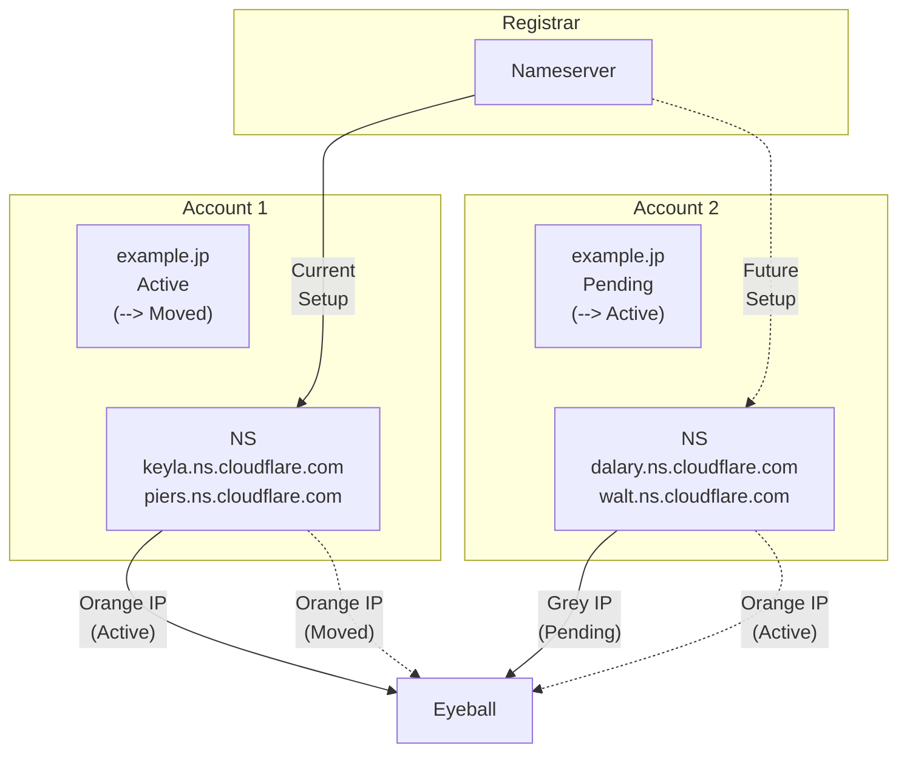

```mermaid
graph TB

Eyeball

subgraph Registrar
  Nameserver
end

subgraph Account1 [Account 1]
  zone1["example.jp<br>Active<br>(--> Moved)"]
  NS1[NS<br>keyla.ns.cloudflare.com<br>piers.ns.cloudflare.com]
  zone1 ~~~ NS1
end

subgraph Account2 [Account 2]
  zone2["example.jp<br>Pending<br>(--> Active)"]
  NS2[NS<br>dalary.ns.cloudflare.com<br>walt.ns.cloudflare.com]
  zone2 ~~~ NS2
end

NS1 --> |"Orange IP<br>(Active)"|Eyeball
NS1 -.-> |"Orange IP<br>(Moved)"|Eyeball
NS2 --> |"Grey IP<br>(Pending)"|Eyeball
NS2 -.-> |"Orange IP<br>(Active)"|Eyeball

Nameserver ---> |Current<br>Setup|NS1
Nameserver -.-> |Future<br>Setup|NS2
```
