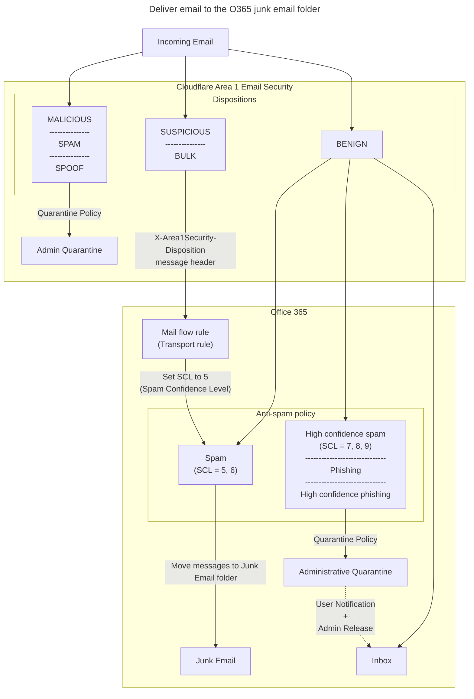

```mermaid
---
title: Deliver email to the O365 junk email folder
---
graph TB
Incoming[Incoming Email] --> MALICIOUS & SUSPICIOUS & BENIGN
subgraph Cloudflare Area 1 Email Security
subgraph Dispositions
MALICIOUS["MALICIOUS<br>---------------<br>SPAM<br>---------------<br>SPOOF"]
SUSPICIOUS["SUSPICIOUS<br>---------------<br>BULK"]
BENIGN
end
Admin[Admin Quarantine]
MALICIOUS --> |Quarantine Policy|Admin
end
subgraph Office 365
MailFlow["Mail flow rule<br>(Transport rule)"]
Junk[Junk Email]
subgraph Anti-spam policy
Spam["Spam<br>(SCL = 5, 6)"]
Hcspam["High confidence spam<br>(SCL = 7, 8, 9)<br>------------------------------<br>Phishing<br>------------------------------<br>High confidence phishing"]
end
Defender[Administrative Quarantine]
Inbox
end
SUSPICIOUS ---> |X-Area1Security-Disposition<br>message header|MailFlow
BENIGN ---> Spam & Hcspam
BENIGN ---> Inbox
MailFlow --> |"Set SCL to 5<br>(Spam Confidence Level)"|Spam
Spam ---> |Move messages to Junk Email folder|Junk
Hcspam --> |Quarantine Policy|Defender
Defender -.-> |User Notification<br>+<br>Admin Release|Inbox
```
