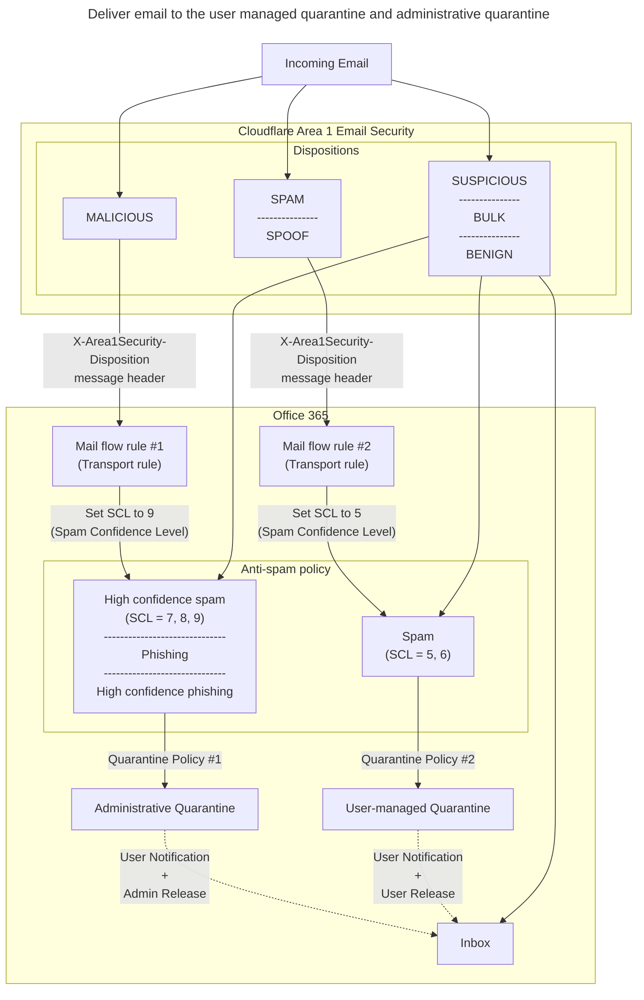

```mermaid
---
title: Deliver email to the user managed quarantine and administrative quarantine
---
graph TB
Incoming[Incoming Email] --> MALICIOUS & SPAM & BENIGN
subgraph Cloudflare Area 1 Email Security
subgraph Dispositions
MALICIOUS
SPAM["SPAM<br>---------------<br>SPOOF"]
BENIGN["SUSPICIOUS<br>---------------<br>BULK<br>---------------<br>BENIGN"]
end
end
MALICIOUS --> |X-Area1Security-Disposition<br>message header|MailFlow1
subgraph Office 365
MailFlow1["Mail flow rule #1<br>(Transport rule)"]
MailFlow2["Mail flow rule #2<br>(Transport rule)"]
SPAM --> |X-Area1Security-Disposition<br>message header|MailFlow2
subgraph Anti-spam policy
Spam["Spam<br>(SCL = 5, 6)"]
Hcspam["High confidence spam<br>(SCL = 7, 8, 9)<br>------------------------------<br>Phishing<br>------------------------------<br>High confidence phishing"]
end
MailFlow2 --> |"Set SCL to 5<br>(Spam Confidence Level)"|Spam
MailFlow1 --> |"Set SCL to 9<br>(Spam Confidence Level)"|Hcspam
Defender[Administrative Quarantine]
User[User-managed Quarantine]
Inbox
end
BENIGN --> Spam & Hcspam
Spam --> |"Quarantine Policy #2"|User
Hcspam --> |"Quarantine Policy #1"|Defender
Defender -.-> |User Notification<br>+<br>Admin Release|Inbox
User -.-> |User Notification<br>+<br>User Release|Inbox
BENIGN --> Inbox
```
