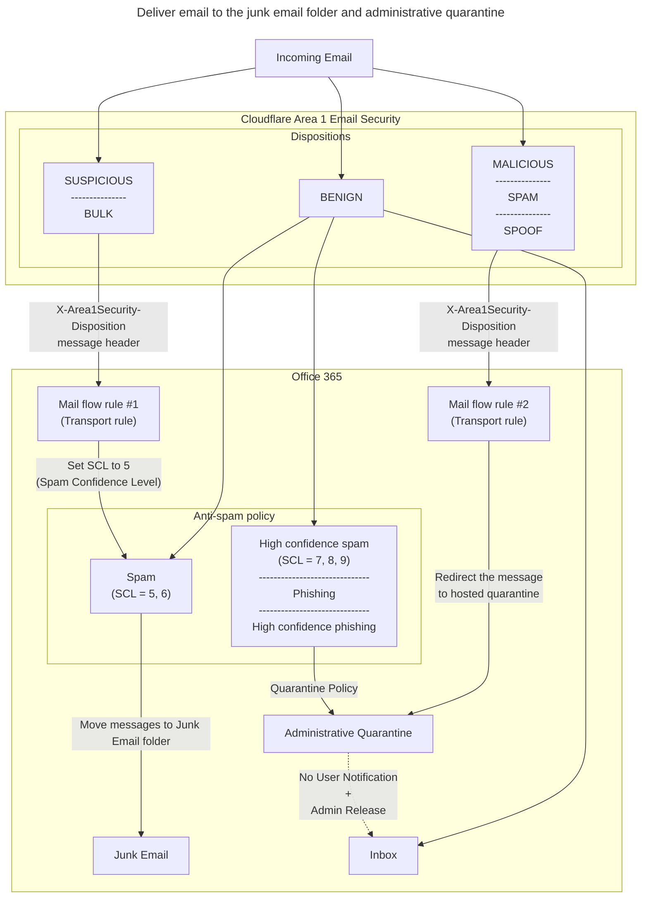

```mermaid
---
title: Deliver email to the junk email folder and administrative quarantine
---
graph TB
accTitle: Deliver email to the junk email folder and administrative quarantine
accDescr: This graphic shows the flow of suspicious and bulk emails delivered to the user's junk folder, and malicious spam and spoof messages delivered to the administrative quarantine.
Incoming[Incoming Email] --> MALICIOUS & SUSPICIOUS & BENIGN
subgraph Cloudflare Area 1 Email Security
subgraph Dispositions
MALICIOUS["MALICIOUS<br>---------------<br>SPAM<br>---------------<br>SPOOF"]
SUSPICIOUS["SUSPICIOUS<br>---------------<br>BULK"]
BENIGN
end
end
MALICIOUS --> |X-Area1Security-Disposition<br>message header|MailFlow2
subgraph Office 365
MailFlow1["Mail flow rule #1<br>(Transport rule)"]
SUSPICIOUS --> |X-Area1Security-Disposition<br>message header|MailFlow1
MailFlow2["Mail flow rule #2<br>(Transport rule)"]
Junk[Junk Email]
subgraph Anti-spam policy
Spam["Spam<br>(SCL = 5, 6)"]
Hcspam["High confidence spam<br>(SCL = 7, 8, 9)<br>------------------------------<br>Phishing<br>------------------------------<br>High confidence phishing"]
end
Defender[Administrative Quarantine]
MailFlow1 --> |"Set SCL to 5<br>(Spam Confidence Level)"|Spam
Inbox
end
Spam ---> |Move messages to Junk Email folder|Junk
Hcspam --> |"Quarantine Policy"|Defender
MailFlow2 --> |"Redirect the message<br>to hosted quarantine"|Defender
Defender -.-> |No User Notification<br>+<br>Admin Release|Inbox
BENIGN --> Spam & Hcspam & Inbox

```
