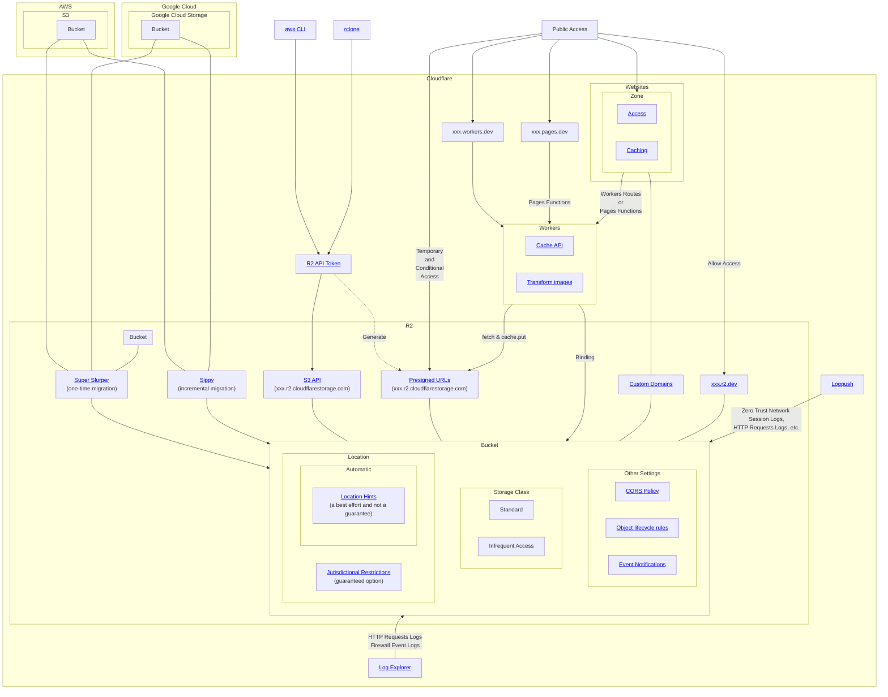

```mermaid
graph TB

subgraph Cloudflare
subgraph Workers
CacheAPI[<a href='https://developers.cloudflare.com/r2/examples/cache-api/'>Cache API</a>]
IR[<a href='https://developers.cloudflare.com/images/transform-images/'>Transform images</a>]
end
subgraph Websites
subgraph Domain[Zone]
direction LR
Access[<a href='https://developers.cloudflare.com/r2/examples/cloudflare-access/'>Access</a>]
Caching[<a href='https://developers.cloudflare.com/r2/buckets/public-buckets/#caching'>Caching</a>]
end
end
WDEV[xxx.workers.dev]
PDEV[xxx.pages.dev]
Logpush[<a href='https://developers.cloudflare.com/logs/get-started/enable-destinations/r2/'>Logpush</a>]
LE[<a href='https://developers.cloudflare.com/logs/log-explorer/'>Log Explorer</a>]
Token[<a href='https://developers.cloudflare.com/r2/api/s3/tokens/'>R2 API Token</a>]
subgraph R2
subgraph R2Bucket [Bucket]
direction LR
subgraph Location
direction LR
subgraph Automatic
Hint["<a href='https://developers.cloudflare.com/r2/reference/data-location/#location-hints'>Location Hints</a><br>(a best effort and not a guarantee)"]
end
Jurisdiction["<a href='https://developers.cloudflare.com/r2/reference/data-location/#jurisdictional-restrictions'>Jurisdictional Restrictions</a><br>(guaranteed option)"]
end
subgraph storageClass [Storage Class]
direction LR
Standard
Infrequent["Infrequent Access"]
end
subgraph Settings[Other Settings]
direction LR
CORS[<a href='https://developers.cloudflare.com/r2/buckets/cors/'>CORS Policy</a>]
Lifecycle[<a href='https://developers.cloudflare.com/r2/buckets/object-lifecycles/'>Object lifecycle rules</a>]
Event[<a href='https://developers.cloudflare.com/r2/buckets/event-notifications/'>Event Notifications</a>]
end
Location ~~~ storageClass ~~~ Settings
end
subgraph R2Bucket2 [Bucket]
end
Sippy["<a href='https://developers.cloudflare.com/r2/data-migration/sippy/'>Sippy</a><br>(incremental migration)"]
Slurper["<a href='https://developers.cloudflare.com/r2/data-migration/super-slurper/'>Super Slurper</a><br>(one-time migration)"]
R2DEV[<a href='https://developers.cloudflare.com/r2/buckets/public-buckets/#enable-managed-public-access'>xxx.r2.dev</a>]
Custom[<a href='https://developers.cloudflare.com/r2/buckets/public-buckets/#custom-domains'>Custom Domains</a>]
presigned["<a href='https://developers.cloudflare.com/r2/api/s3/presigned-urls/'>Presigned URLs</a><br>(xxx.r2.cloudflarestorage.com)"]
S3API["<a href='https://developers.cloudflare.com/r2/api/s3/api/'>S3 API</a><br>(xxx.r2.cloudflarestorage.com)"]
end
end

subgraph AWS
subgraph S3
S3Bucket1[Bucket]
end
end

subgraph GCP [Google Cloud]
subgraph GCS [Google Cloud Storage]
GCSBucket1[Bucket]
end
end

S3Bucket1 ------ Slurper & Sippy --> R2Bucket
GCSBucket1 ------ Slurper & Sippy
R2Bucket2 --- Slurper

R2Bucket ~~~ LE --> |HTTP Requests Logs<br>Firewall Event Logs|R2Bucket
LE ~~~ R2Bucket

cli[<a href='https://developers.cloudflare.com/r2/examples/aws/aws-cli/'>aws CLI</a>] & rclone[<a href='https://developers.cloudflare.com/r2/examples/rclone/'>rclone</a>] ---> Token --> S3API --- R2Bucket
Token -..-> |Generate|presigned
Public --> |Temporary<br>and<br>Conditional<br>Access|presigned --- R2Bucket

WDEV --> Workers ----> |Binding|R2Bucket
Public --> PDEV --> |Pages Functions|Workers
Public[Public Access] --> Domain ----- Custom --- R2Bucket
Domain --> |Workers Routes<br>or<br>Pages Functions|Workers
Public --> WDEV

Workers --> |fetch & cache.put|presigned
Public --> |Allow Access|R2DEV --- R2Bucket
Logpush --> |Zero Trust Network Session Logs,<br>HTTP Requests Logs, etc.|R2Bucket

```
