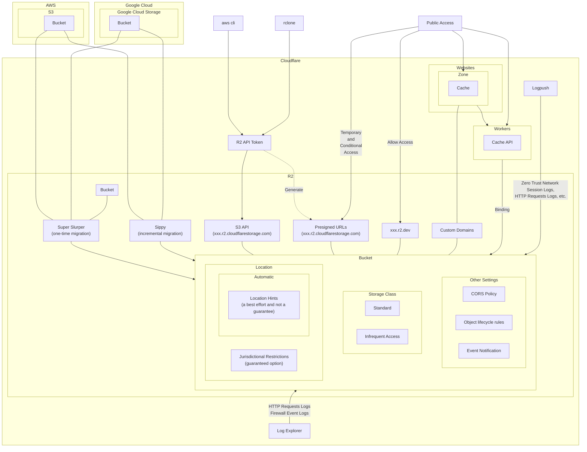

```mermaid
graph TB

subgraph Cloudflare
subgraph Workers
CacheAPI[Cache API]
end
subgraph Websites
subgraph Domain[Zone]
Cache
end
end
Logpush
LE[Log Explorer]
Token[R2 API Token]
subgraph R2
subgraph R2Bucket [Bucket]
direction LR
subgraph Location
direction LR
subgraph Automatic
Hint["Location Hints<br>(a best effort and not a guarantee)"]
end
Jurisdiction["Jurisdictional Restrictions<br>(guaranteed option)"]
end
subgraph storageClass [Storage Class]
direction LR
Standard
Infrequent["Infrequent Access"]
end
subgraph Settings[Other Settings]
direction LR
CORS[CORS Policy]
Lifecycle[Object lifecycle rules]
Event[Event Notification]
end
Location ~~~ storageClass ~~~ Settings
end
subgraph R2Bucket2 [Bucket]
end
Sippy["Sippy<br>(incremental migration)"]
Slurper["Super Slurper<br>(one-time migration)"]
R2DEV[xxx.r2.dev]
Custom[Custom Domains]
presigned["Presigned URLs<br>(xxx.r2.cloudflarestorage.com)"]
S3API["S3 API<br>(xxx.r2.cloudflarestorage.com)"]
end
end

subgraph AWS
subgraph S3
S3Bucket1[Bucket]
end
end

subgraph GCP [Google Cloud]
subgraph GCS [Google Cloud Storage]
GCSBucket1[Bucket]
end
end

S3Bucket1 ------ Slurper & Sippy --> R2Bucket
GCSBucket1 ------ Slurper & Sippy
R2Bucket2 --- Slurper

R2Bucket ~~~ LE --> |HTTP Requests Logs<br>Firewall Event Logs|R2Bucket
LE ~~~ R2Bucket

cli[aws cli] & rclone ---> Token --> S3API --- R2Bucket
Token -..-> |Generate|presigned
Public --> |Temporary<br>and<br>Conditional<br>Access|presigned --- R2Bucket

Public --> |Allow Access|R2DEV --- R2Bucket
Public[Public Access] --> Domain ----- Custom --- R2Bucket
Domain --> Workers
Public --> Workers ----> |Binding|R2Bucket

Logpush -----> |Zero Trust Network Session Logs,<br>HTTP Requests Logs, etc.|R2Bucket
```
