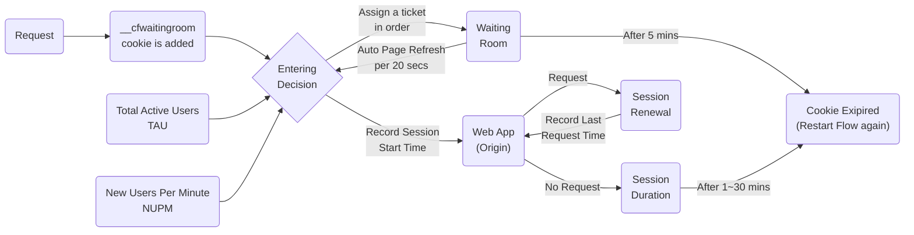

```mermaid
graph LR
リクエスト(Request)-->Cookie(__cfwaitingroom<br>cookie is added)
待合室(Waiting<br>Room)-->|After 5 mins|4("Cookie Exipired<br>(Restart Flow again)")
待合室-->|Auto Page Refresh<br>per 20 secs|判定{Entering<br>Decision}
Cookie-->判定
判定-->|Assign a ticket<br> in order|待合室
判定-->|Record Session<br>Start Time|Webアプリ
Webアプリ("Web App<br>(Origin)")-->|Request|Renewal(Session<br>Renewal)
Renewal-->|Record Last<br>Request Time|Webアプリ
Webアプリ-->|No Request|3(Session<br>Duration)
1("Total Active Users<br>TAU")-->判定
2("New Users Per Minute<br>NUPM")-->判定
3-->|"After 1~30 mins"|4
```
