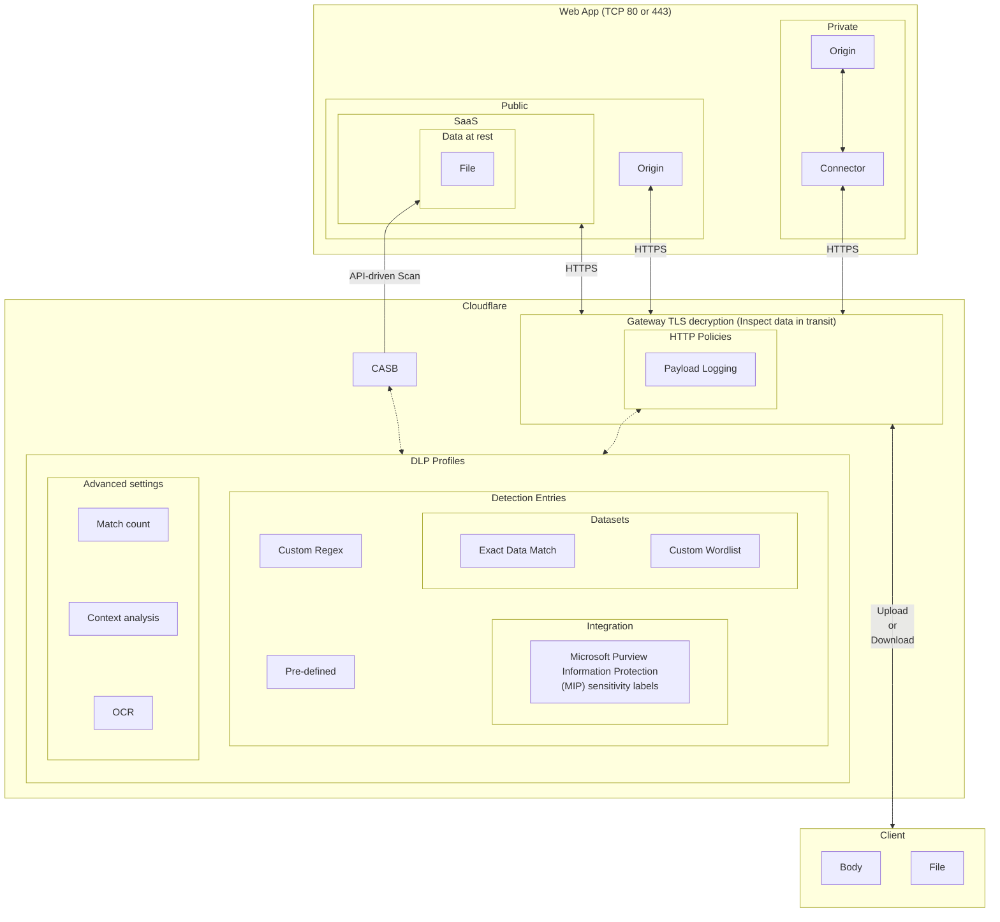

```mermaid
graph BT

subgraph Web ["Web App (TCP 80 or 443)"]
subgraph Private
Connector
Intranet[Origin]
end
subgraph Public
Internet[Origin]
subgraph SaaS
subgraph rest [Data at rest]
SaaSFile[File]
end
end
end
end

subgraph Client
Body
File
end

subgraph Cloudflare
  subgraph Gateway ["Gateway TLS decryption (Inspect data in transit)"]
    %%subgraph transit [Inspect data in transit]
      subgraph HTTPPolicies["HTTP Policies"]
        PayloadLogging[Payload Logging]
      end
    %%end
  end
  subgraph DLP [DLP Profiles]
    subgraph Entries [Detection Entries]
    direction LR
      Pre-defined
      CustomRegex[Custom Regex]
      Pre-defined ~~~ Integration
      CustomRegex ~~~ Datasets
      subgraph Integration
        MIP["Microsoft Purview Information Protection<br>(MIP) sensitivity labels"]
      end
      subgraph Datasets
      direction LR
        EDM[Exact Data Match]
        CWL[Custom Wordlist]
        EDM ~~~ CWL
      end
    end
    subgraph Config [Advanced settings]
    direction TB
      MatchCount[Match count]
      ContextAnalysis[Context analysis]
      OCR
      MatchCount ~~~ ContextAnalysis ~~~ OCR
    end
  end
  CASB
end

Client <---> |Upload<br>or<br>Download|Gateway
Gateway <--> |HTTPS|Internet & SaaS
Gateway <--> |HTTPS|Connector <--> Intranet
CASB --> |API-driven Scan|rest
DLP <-.-> HTTPPolicies
DLP ~~~ CASB
DLP <-.-> CASB
DLP ~~~ CASB
```
