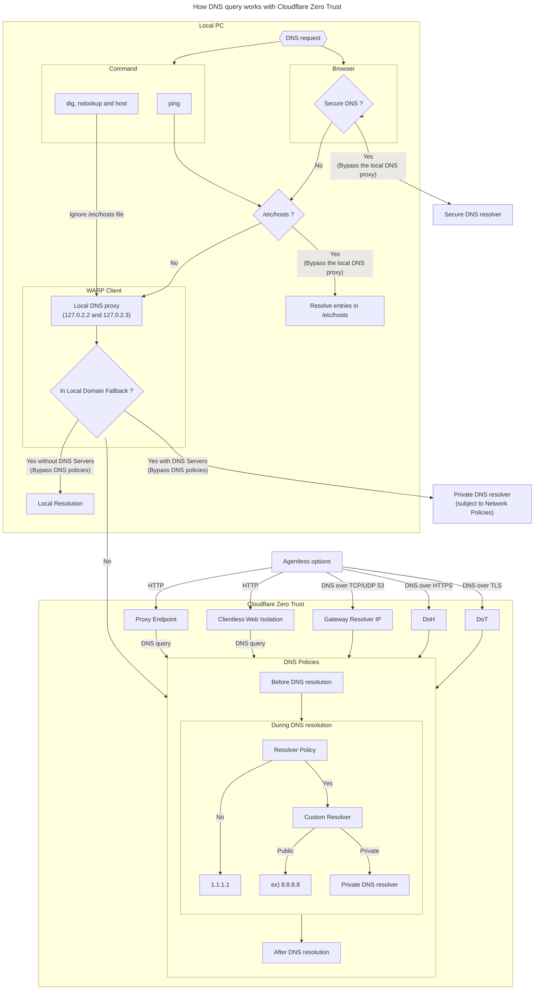

```mermaid
---
title: How DNS query works with Cloudflare Zero Trust
---
graph TB

Agentless[Agentless options] --> |DNS over TCP/UDP 53|RIP
Agentless[Agentless options] --> |DNS over HTTPS|DoH
Agentless[Agentless options] --> |DNS over TLS|DoT
Agentless[Agentless options] --> |HTTP|BISO & PE
DoT & DoH & RIP --> G
BISO & PE --> |DNS query|G

D{{DNS request}} -->  Command & Browser
Browser --> SecureDNS{Secure DNS ?}
SecureDNS --> |"Yes<br>(Bypass the local DNS proxy)"|SDR[Secure DNS resolver]
SecureDNS --> |No|hosts{"/etc/hosts ?"}
hosts --> |"Yes<br>(Bypass the local DNS proxy)"|H[Resolve entries in /etc/hosts]
ping --> hosts
hosts --> |No|DNSproxy["Local DNS proxy<br>(127.0.2.2 and 127.0.2.3)"] -->R{In Local Domain Fallback ?}
dig --> |Ignore /etc/hosts file|DNSproxy
%%R -- "Yes<br>(Bypass DNS policies)" --> DNSServers{DNS Servers<br>are specified ?}
R -- "Yes with DNS Servers<br>(Bypass DNS policies)" --> F["Private DNS resolver<br>(subject to Network Policies)"] 
R -- "Yes without DNS Servers<br>(Bypass DNS policies)" --> Local[Local Resolution]
%%DNSServers --> |Yes|F["Private DNS resolver<br>(subject to Network Policies)"]
%%DNSServers --> |No|Local[Local Resolution]
R -- No -----> G

subgraph LocalPC [Local PC]
direction TB
Local
D
subgraph Command
ping
dig["dig, nslookup and host"]
end
subgraph Browser
SecureDNS
end
subgraph WARP [WARP Client]
DNSproxy
R
end
hosts
H
end


subgraph CF [Cloudflare Zero Trust]
direction TB
subgraph G [DNS Policies]
direction TB
Before[Before DNS resolution]
subgraph During [During DNS resolution]
direction TB
ResolverPolicy[Resolver Policy]
CustomResolver[Custom Resolver]
1111[1.1.1.1]
ResolverPolicy ---> |No|1111
ResolverPolicy --> |Yes|CustomResolver
8888["ex) 8.8.8.8"]
PrivateDNS2[Private DNS resolver]
CustomResolver --> |Public|8888
CustomResolver --> |Private|PrivateDNS2
end
After[After DNS resolution]
end
BISO[Clientless Web Isolation]
PE[Proxy Endpoint]
DoT
DoH
RIP[Gateway Resolver IP]
end


Before --> During
During --> After
```
